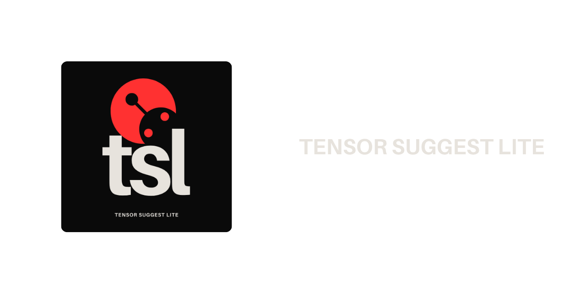

# TensorSuggestLite v2



[](https://www.python.org/)
[](#)
[](#)
[](LICENSE)

TensorSuggestLite es una utilidad ligera para interpretar datos de configuración (JSON, TOML, YAML) y entrenar un clasificador de texto simple a partir de esos ficheros. Proporciona intérpretes por formato, un entrenador que exporta artefactos (tokenizer, modelo Keras y label encoder) y una conversión a TFLite para desplegar en dispositivos embebidos.

Características principales
-------------------------

- Interpreta entradas en JSON, TOML y YAML con estructura esperada por los intérpretes.
- Entrenador basado en TensorFlow/Keras con callbacks de progreso y logging.
- Exporta artefactos en `generated/<format>/`:
  - `tokenizer.json`
  - `text_classifier.keras`
  - `label_encoder.json`
  - `text_classifier.tflite` (tras conversión)
- Interfaz gráfica simple (PyQt6) para importar archivos, entrenar, convertir y exportar.
- Diseño modular: cada formato tiene su propio intérprete y trainer (`json_interpreter/`, `toml_interpreter/`, `yaml_interpreter/`).

Instalación
-----------

Se recomienda crear un entorno virtual antes de la instalación:

```bash
python -m venv .venv
source .venv/bin/activate   # macOS / Linux (zsh/bash)
```

Instala las dependencias listadas en `requirements.txt`:

```bash
pip install -r requirements.txt
```

Nota: TensorFlow es la dependencia más pesada; si sólo quieres revisar el código sin ejecutar entrenamientos, puedes omitir instalar TensorFlow hasta que vayas a entrenar.

Uso rápido (Quickstart)
-----------------------

1) Ejecutar la interfaz gráfica (GUI):

```bash
python tensorsuggestlite.py
```

La aplicación abrirá una ventana donde puedes importar un archivo JSON/TOML/YAML, entrenar el modelo, convertirlo a TFLite y exportarlo.

2) Uso programático (ejemplo de entrenamiento desde JSON):

```bash
python - <<'PY'
from json_interpreter import trainer as jt
# Entrena sin callbacks (bloqueante) — requiere TensorFlow y dependencias instaladas
result = jt.train_from_json('test/question_data.json')
print('Resultado:', result)
PY
```

3) Ejemplo con callbacks de progreso y logs (para integrar en scripts o probar sin GUI):

```python
from json_interpreter import trainer as jt

def progress_cb(pct):
    print(f'Progreso: {pct}%')

def log_cb(msg):
    print('LOG:', msg)

res = jt.train_from_json('test/question_data.json', progress_cb=progress_cb, log_cb=log_cb)
print('Artefactos generados:', res)
```

4) Conversión a TFLite (programática):

```python
from json_interpreter import trainer as jt
# Convierte el modelo guardado en generated/json
out = jt.convert_to_tflite()
print('TFLite guardado en:', out)
```

Estructura del proyecto
-----------------------

Resumen de los archivos y carpetas más relevantes:

```
/
├── tensorsuggestlite.py        # Punto de entrada (GUI y orquestador)
├── requirements.txt            # Dependencias recomendadas
├── README.md                   # (este archivo)
├── generated/                  # Artefactos de entrenamiento y conversión
│   ├── json/
│   ├── toml/
│   └── yaml/
├── json_interpreter/           # Lógica y trainer para JSON
│   └── trainer.py
├── toml_interpreter/           # Lógica y trainer para TOML
│   └── trainer.py
├── yaml_interpreter/           # Lógica y trainer para YAML
│   └── trainer.py
├── test/                       # Datos de ejemplo (JSON/TOML/YAML)
└── icons/                      # Iconos y recursos UI
```

Requisitos
----------

Extraídos de `requirements.txt`:

- Python 3.8+
- tensorflow
- numpy
- scikit-learn
- PyQt6
- PyYAML
- toml

Nota: versiones concretas no están fijadas en `requirements.txt`. Para producción se recomienda pinnear versiones en un `requirements-lock.txt` o usar poetry/poetry.lock.

Salida esperada / Artefactos
---------------------------

Tras un entrenamiento exitoso (por ejemplo con `train_from_json`) el trainer escribe en `generated/<format>/` los siguientes ficheros:

- tokenizer.json
- text_classifier.keras
- label_encoder.json

La conversión (convert_to_tflite) crea `text_classifier.tflite` en la misma carpeta.

Consejos y troubleshooting
--------------------------

- Error por falta de TensorFlow: asegúrate de haber instalado `tensorflow` y que tu entorno tiene suficiente memoria.
- Problemas de OOM en entrenamiento: reduce el tamaño del batch o entrena en una máquina con más RAM/GPU.
- Si la GUI no muestra iconos, verifica que la carpeta `icons/` y los svg están presentes.
- Para pruebas rápidas puedes usar los ejemplos en `test/`.

Contribuir
---------

Contribuciones son bienvenidas:

- Abre un issue para reportar bugs o proponer features.
- Envía pull requests contra la rama `main` (o la rama por defecto en tu repo).
- Añade tests para nuevas funcionalidades y asegúrate de que las dependencias necesarias se declaran en `requirements.txt`.

Agradecimientos y créditos
--------------------------

Desarrollado por CoreRed Project.
Iconos y assets provistos en la carpeta `icons/`.

Licencia
--------

Este proyecto está licenciado bajo la "CoreRed Public Non-Commercial License (CR-NC-1.0)".

Resumen (no sustituye el texto completo en `LICENSE`):

- Permite el uso público, copia, modificación y redistribución de este software.
- Las distribuciones derivadas NO pueden ser vendidas ni explotadas comercialmente.
- Se recomienda (pero no es obligatorio) acreditar a CoreRed Project en redistribuciones.
- Los modelos, pesos, tokenizadores o artefactos generados por entrenamientos son propiedad del usuario que los crea, no de CoreRed.
- El software se entrega "tal cual" sin garantías.

Consulta el texto completo de la licencia en `LICENSE` para detalles y condiciones legales.

Contacto
--------

Si necesitas soporte o quieres colaborar, abre un issue en el repositorio o contacta al mantenedor principal del proyecto [Houjou Sxnnyside](https://github.com/HoujouSxnnyside) del equipo CoreRed Project.
